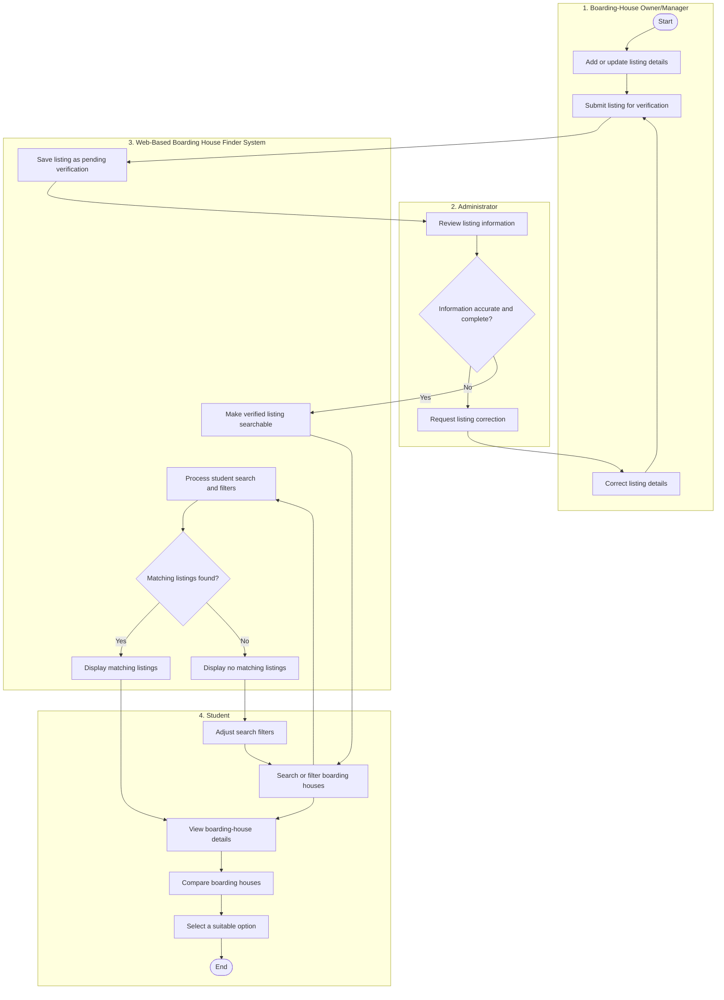

# Activity Diagram – Web-Based Boarding House Finder

This activity diagram illustrates the workflow for submitting and verifying boarding-house listings and searching for suitable boarding houses. It includes the Owner/Manager, Administrator, System, and Student swimlanes.

Key:
- `Yes` – The listing information is accurate and complete, or matching boarding houses are found.
- `No` – The listing needs correction, or no matching boarding houses are found.
- The correction loop returns the listing to the Owner/Manager.
- The search loop allows the Student to adjust filters and search again.
