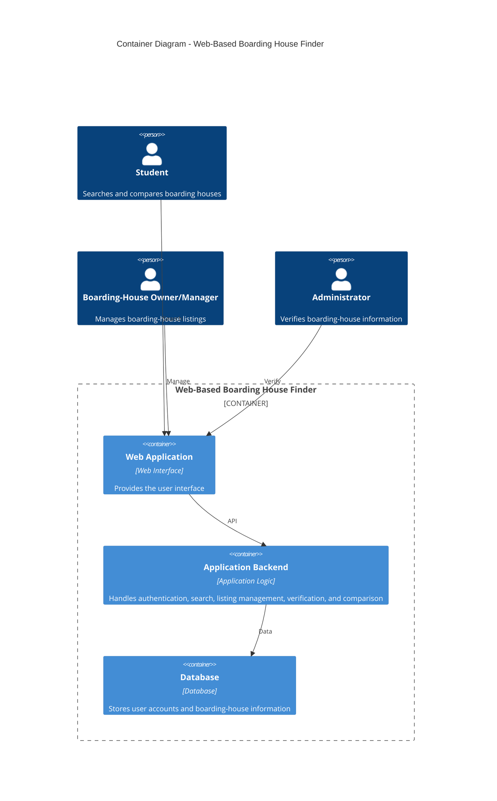

# C4 Container Diagram

```mermaid
C4Container

title Container Diagram - Web-Based Boarding House Finder

UpdateLayoutConfig($c4ShapeInRow="3", $c4BoundaryInRow="1")

Person(student, "Student", "Searches and compares boarding houses")
Person(owner, "Boarding-House Owner/Manager", "Manages boarding-house listings")
Person(admin, "Administrator", "Verifies boarding-house information")

Container_Boundary(system, "Web-Based Boarding House Finder") {
    Container(web, "Web Application", "Web Interface", "Provides the user interface")
    Container(backend, "Application Backend", "Application Logic", "Handles authentication, search, listing management, verification, and comparison")
    Container(database, "Database", "Database", "Stores user accounts and boarding-house information")
}

Rel_D(student, web, "Search")
Rel_D(owner, web, "Manage")
Rel_D(admin, web, "Verify")
Rel_R(web, backend, "API")
Rel_R(backend, database, "Data")
```
