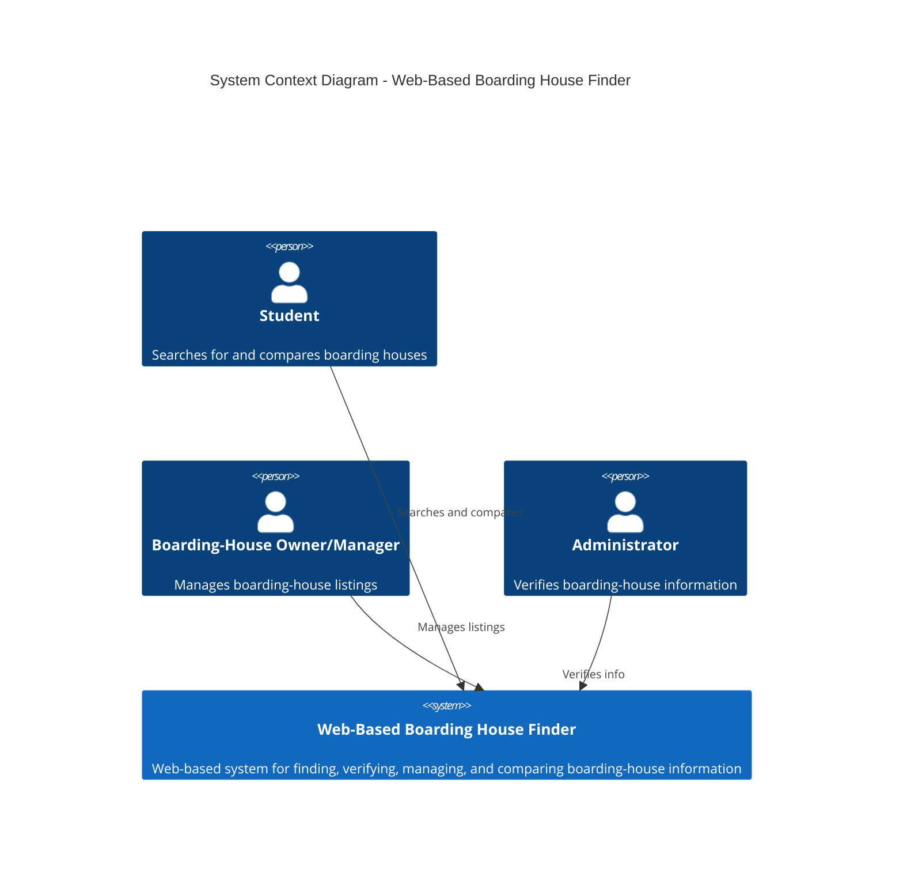

# C4 System Context Diagram

```mermaid
C4Context

title System Context Diagram - Web-Based Boarding House Finder

UpdateLayoutConfig($c4ShapeInRow="2", $c4BoundaryInRow="1")

Person(student, "Student", "Searches for and compares boarding houses")
Person(owner, "Boarding-House Owner/Manager", "Manages boarding-house listings")
Person(admin, "Administrator", "Verifies boarding-house information")

System(finder, "Web-Based Boarding House Finder", "Web-based system for finding, verifying, managing, and comparing boarding-house information")

Rel_D(student, finder, "Searches and compares")
Rel_R(owner, finder, "Manages listings")
Rel_L(admin, finder, "Verifies info")

UpdateRelStyle(admin, finder, $offsetX="-35", $offsetY="30")
UpdateRelStyle(student, finder, $offsetY="-20")
UpdateRelStyle(owner, finder, $offsetY="-20")
```
