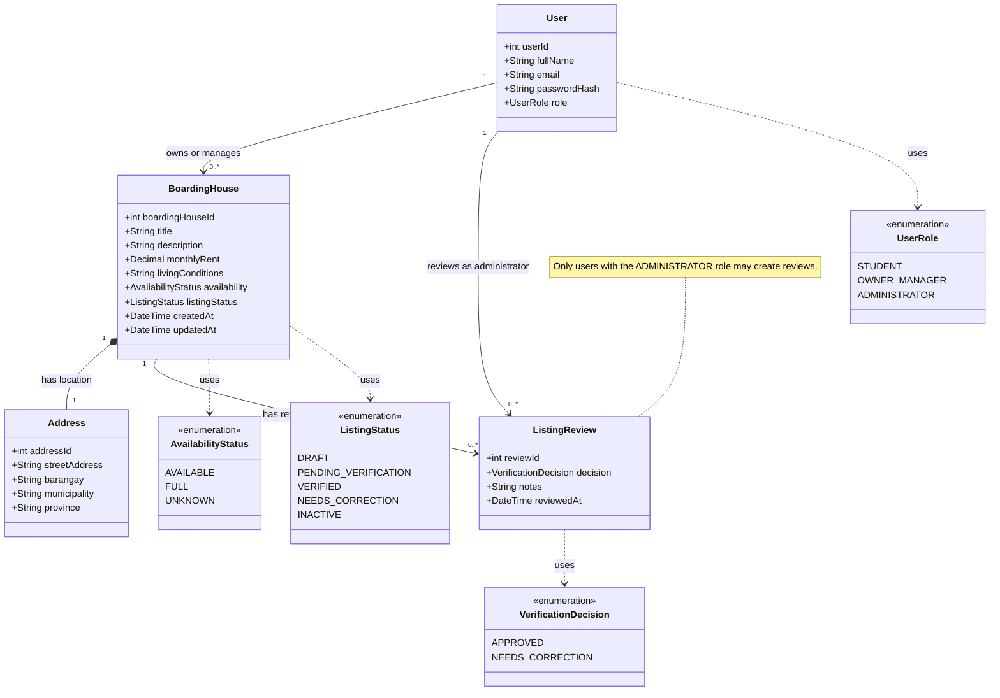

# Class Diagram — Web-Based Boarding House Finder

**Project:** Web-Based Boarding House Finder  
**Team:** Fourward Devs  
**Block:** BSIS 4-1  
**School:** Sorsogon State University (SorSU), Bulan Campus

## Scope

This class diagram presents the core domain classes of the Web-Based Boarding House Finder, including user roles, boarding-house information, address details, and listing verification records.

## Design Constraints

- Only users with the `ADMINISTRATOR` role may create listing reviews.
- Each boarding house has one owner or manager and one address.
- A boarding house may have multiple listing reviews over time.
- The enumerations define the allowed user roles, availability values, listing statuses, and verification decisions.

## Intended Audience

Project developers, system designers, database designers, and project evaluators who need to understand the system's core domain entities, attributes, relationships, and allowed status values.

## Risk Reduced

This view helps reduce ambiguity about the system's data model, the relationships between users and boarding houses, the recording of listing verification history, and the allowed values for roles and statuses.

## View Note

This is a proposed conceptual design. The class attributes, associations, and constraints should be checked against the team's agreed requirements and actual implementation. The administrator-only review rule is a role constraint that must be enforced by the application.
