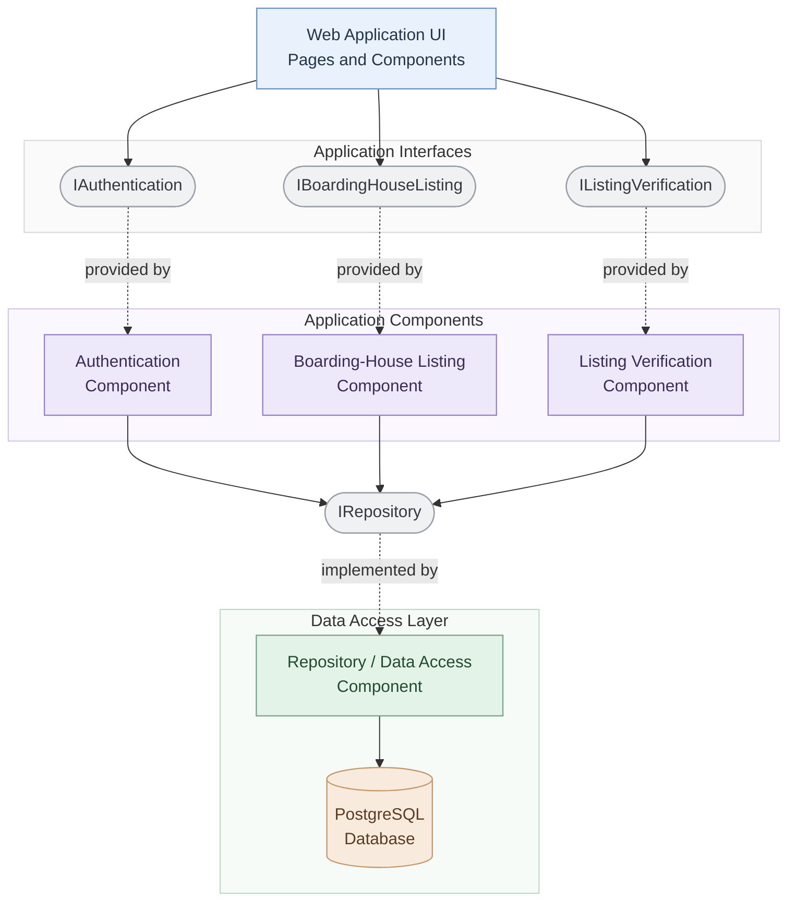

# UML Component Diagram — Web-Based Boarding House Finder

**Project:** Web-Based Boarding House Finder  
**Team:** Fourward Devs  
**Block:** BSIS 4-1  
**School:** Sorsogon State University (SorSU), Bulan Campus

## Scope

This diagram presents the proposed logical components and interfaces of the Web-Based Boarding House Finder. It shows how the web interface accesses authentication, boarding-house listing, and listing verification functionality, and how these application components access persistent data through a repository interface.

## UML Component Diagram

## Component Descriptions

- **Web Application UI:** Presents the pages and reusable interface components used by students, boarding-house owners or managers, and administrators.
- **Authentication Component:** Handles registration, login, and authentication-related operations.
- **Boarding-House Listing Component:** Supports browsing, searching, filtering, viewing, comparing, and managing boarding-house listings.
- **Listing Verification Component:** Supports administrator review, approval, and requests for listing corrections.
- **Repository / Data Access Component:** Implements data access operations through the repository interface.
- **PostgreSQL Database:** Represents the proposed persistent data store for user accounts, boarding-house details, availability, and verification records.

## Interface Descriptions

- **IAuthentication:** Provides authentication-related functionality to the web interface.
- **IBoardingHouseListing:** Provides boarding-house listing functionality to the web interface.
- **IListingVerification:** Provides listing verification functionality to the web interface.
- **IRepository:** Defines the data access operations required by the application components and implemented by the repository component.

## Diagram Key

- **Solid arrow (`-->`):** Represents a usage or dependency relationship.
- **Dashed arrow (`-.->`):** Indicates which component provides or implements an interface, as identified by the arrow label.
- **Rounded interface nodes:** Represent named interfaces between components.

## Design Notes

- This diagram represents a proposed logical component architecture, not confirmation of the current implementation.
- PostgreSQL is shown as the proposed database technology and should remain consistent with the team's approved container and deployment diagrams.
- The named interfaces are conceptual contracts; their actual methods and endpoints should be defined during implementation.
- The application components may be implemented as modules within one web application rather than separate deployable services.
- Confirm the components, interfaces, and dependencies with the team before treating this diagram as final.
