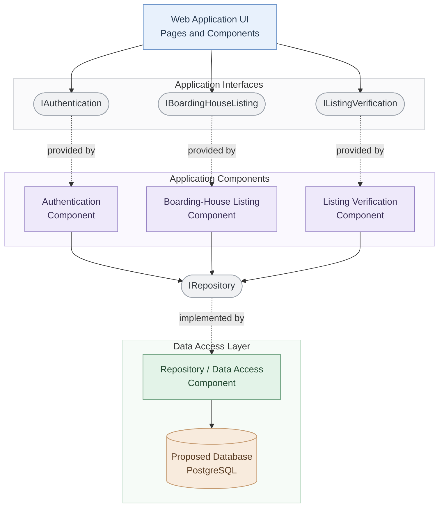

# UML Component Diagram — Web-Based Boarding House Finder

**Project:** Web-Based Boarding House Finder  
**Team:** Fourward Devs  
**Block:** BSIS 4-1  
**School:** Sorsogon State University (SorSU), Bulan Campus

## 1. Scope

This diagram presents the proposed logical components and interfaces of the Web-Based Boarding House Finder. It illustrates how the web interface uses authentication, boarding-house listing, and listing verification functionality, and how application components access persistent data through a repository interface.

## 2. UML Component Diagram

## 3. Component Descriptions

- **Web Application UI:** Presents the pages and reusable interface components used by students, boarding-house owners or managers, and administrators.
- **Authentication Component:** Represents the planned registration, login, and authentication functionality.
- **Boarding-House Listing Component:** Represents the planned browsing, searching, filtering, viewing, comparing, and listing-management functionality.
- **Listing Verification Component:** Represents the planned administrator review, approval, and correction-request functionality.
- **Repository / Data Access Component:** Represents the proposed component responsible for accessing and persisting application data.
- **PostgreSQL Database:** Represents the proposed persistent data store for user accounts, boarding-house details, availability, and verification records.

## 4. Interface Descriptions

- **IAuthentication:** Defines the proposed authentication functionality available to the web interface.
- **IBoardingHouseListing:** Defines the proposed boarding-house listing functionality available to the web interface.
- **IListingVerification:** Defines the proposed listing verification functionality available to the web interface.
- **IRepository:** Represents the proposed data access contract used by application components and implemented by the repository component.

The interfaces are conceptual contracts. Their actual methods, parameters, and implementation details will be determined during system development.

## 5. Diagram Key

- **Solid arrow (`-->`):** Represents a dependency or usage relationship.
- **Dashed arrow (`-.->`):** Indicates the relationship identified by its label, such as an interface being provided by a component or implemented by a repository component.
- **Rounded interface nodes:** Represent conceptual interfaces between components.

## 6. Intended Audience

Developers, system analysts, project advisers, and team members responsible for planning application components, interfaces, and data access.

## 7. Risk Reduced

Reduces the risk of unclear component responsibilities, tightly coupled modules, and inconsistent interactions between application functionality and data access.

## 8. Design Notes

- This diagram represents a proposed logical component architecture, not a confirmed implementation.
- PostgreSQL is a proposed database technology and must remain consistent with the team's approved architecture and deployment decisions.
- The named interfaces are conceptual contracts; their actual methods and endpoints should be defined during implementation.
- The application components may be implemented as modules within one web application rather than as separate deployable services.
- The diagram does not establish that the interfaces or components have already been created in source code.
- Confirm the components, interfaces, dependencies, and database technology with the team before treating this diagram as final.

## 9. View Note

This diagram describes the proposed logical organization and interaction of the system's components. It will be refined to match the approved requirements, selected technologies, and actual implementation as development progresses.
