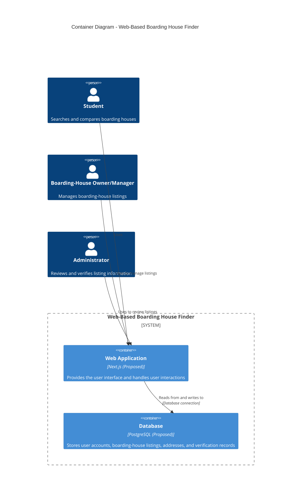

# C4 Container Diagram

**Diagram Type:** C4 Container Diagram

**Scope:** This view describes the proposed high-level technical structure of the Web-Based Boarding House Finder, including its web application and database. It shows how the three main user roles interact with the application and how the application accesses stored information.

**Intended Audience:** Project developers, system designers, technical evaluators, and project stakeholders who need to understand the system's main technical building blocks.

**Risk Reduced:** This view helps reduce ambiguity about the system's internal structure, the responsibility of each container, and the application's relationship with persistent data storage.

**Assumptions and Limitations:** Next.js and PostgreSQL are proposed technologies and must be confirmed against the team's actual implementation. This diagram does not describe deployment infrastructure, detailed application modules, or database table relationships.
