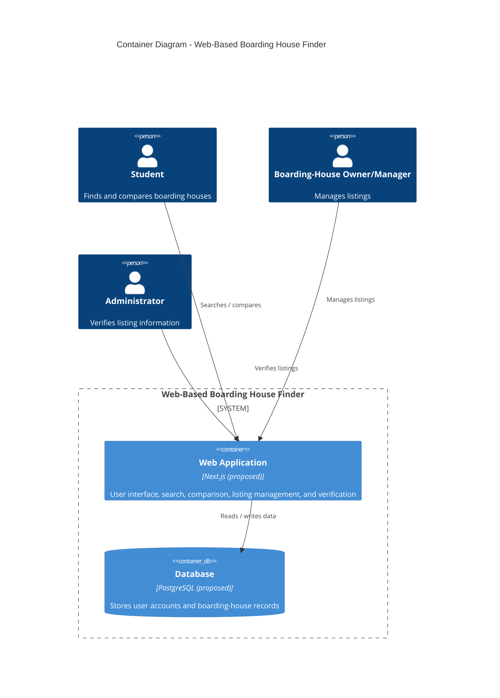

# C4 Container Diagram

```mermaid
C4Container
title Container Diagram - Web-Based Boarding House Finder

UpdateLayoutConfig($c4ShapeInRow="3", $c4BoundaryInRow="1")

Person(student, "Student", "Finds and compares boarding houses")
Person(owner, "Boarding-House Owner/Manager", "Manages listings")
Person(admin, "Administrator", "Verifies listing information")

System_Boundary(system, "Web-Based Boarding House Finder") {
    Container(web, "Web Application", "Next.js (proposed)", "User interface, search, comparison, listing management, and verification")
    ContainerDb(database, "Database", "PostgreSQL (proposed)", "Stores user accounts and boarding-house records")
}

Rel_D(student, web, "Searches / compares")
Rel_D(owner, web, "Manages listings")
Rel_D(admin, web, "Verifies listings")
Rel_R(web, database, "Reads / writes data")

UpdateRelStyle(student, web, $offsetX="-1", $offsetY="-35")
UpdateRelStyle(owner, web, $offsetX="53", $offsetY="-45")
UpdateRelStyle(admin, web, $offsetX="104", $offsetY="-35")
UpdateRelStyle(web, database, $offsetX="-50", $offsetY="-23")
```
