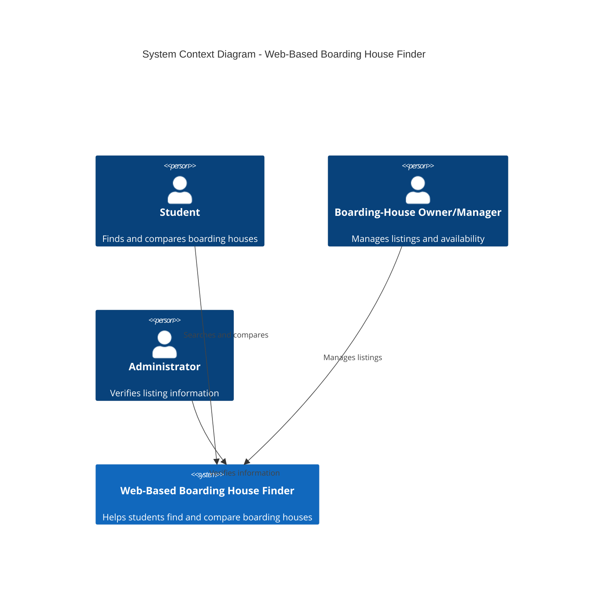

# C4 System Context Diagram

**Diagram Type:** C4 System Context Diagram

**Scope:** This diagram presents the Web-Based Boarding House Finder as a single system and shows its primary users and their interactions with it. It does not describe the system's internal components or database structure.

**Intended Audience:** SorSU Bulan Campus students, boarding-house owners or managers, administrators, project developers, and project evaluators.

**Risk Reduced:** This view helps reduce misunderstandings about the system boundary, its primary users, and the responsibilities of each user. It provides a shared understanding of who interacts with the system and why.

**View Note:** This is a high-level view of the proposed system. Internal application components, data storage, and technical deployment details are described in the corresponding architecture diagrams.
