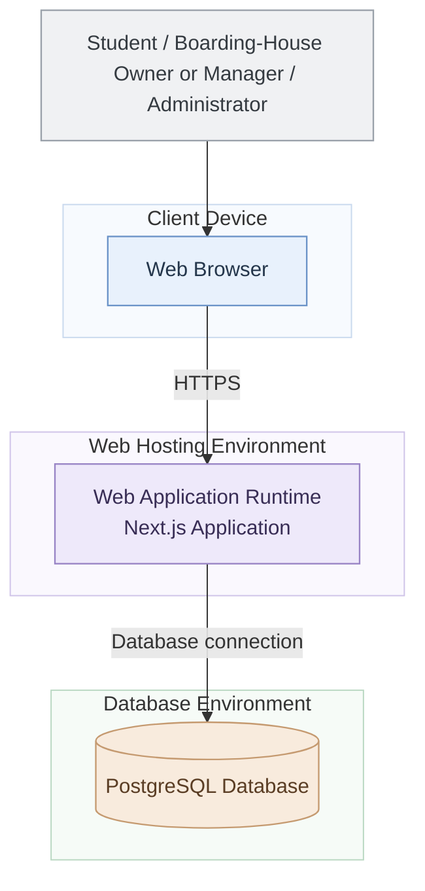

# Provisional Deployment Diagram — Web-Based Boarding House Finder

**Project:** Web-Based Boarding House Finder  
**Team:** Fourward Devs  
**Block:** BSIS 4-1  
**School:** Sorsogon State University (SorSU), Bulan Campus  
**Status:** Provisional — subject to confirmation of the final deployment environment

## 1. Scope

This diagram presents the proposed deployment architecture of the Web-Based Boarding House Finder. It illustrates how students, boarding-house owners or managers, and administrators access the web application through a browser and how the application communicates with the database.

## 2. Deployment Diagram

## 3. Deployment Node Descriptions

- **Client Device:** Represents the device used by students, boarding-house owners or managers, and administrators to access the system.
- **Web Browser:** Displays the web interface and allows users to interact with the application.
- **Web Hosting Environment:** Represents the proposed environment where the Next.js web application runs.
- **Database Environment:** Represents the proposed environment where the PostgreSQL database stores persistent system data.

## 4. Communication Protocols

- **HTTPS:** Represents secure communication between the user's web browser and the web application.
- **Database connection:** Represents communication between the web application and PostgreSQL. The actual database protocol, credentials, and connection configuration depend on the final deployment setup.

## 5. Diagram Key

- **Rectangular nodes:** Represent users, client software, or application runtime environments.
- **Cylinder node:** Represents the database.
- **Solid arrows:** Represent the intended access or communication path between nodes.
- **Labeled arrows:** Identify the communication method or connection.

## 6. Architecture Notes

- This diagram is provisional and represents a proposed deployment architecture, not a verified description of the current production environment.
- The final hosting provider, server configuration, database hosting arrangement, and deployment settings must be confirmed by the team.
- The deployment architecture must remain consistent with the approved container and component diagrams.
- The team should finalize this diagram by Week 12 after confirming the actual deployment environment.
