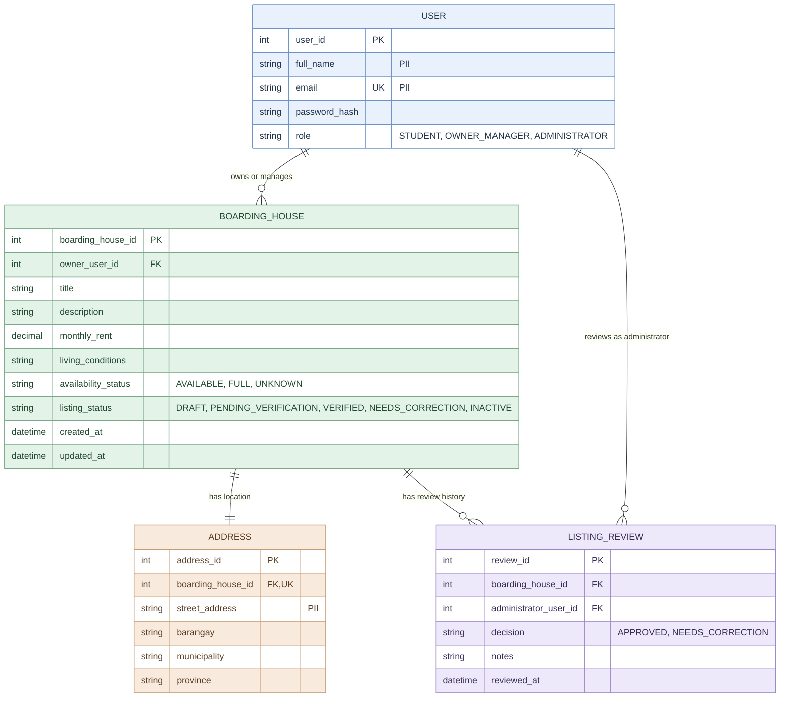

# ERD Draft — Web-Based Boarding House Finder

**Project:** Web-Based Boarding House Finder  
**Team:** Fourward Devs  
**Block:** BSIS 4-1  
**School:** Sorsogon State University (SorSU), Bulan Campus  
**Status:** Draft — subject to validation before implementation

## 1. Purpose

This Entity-Relationship Diagram (ERD) presents the proposed database structure for the Web-Based Boarding House Finder. It models user accounts, boarding-house listings, addresses, and administrator review records.

## 2. ERD Diagram

## 3. Entity Descriptions

- **USER:** Stores user account information and role.
- **BOARDING_HOUSE:** Stores listing details, rental price, availability, and listing status.
- **ADDRESS:** Stores the location details of a boarding house.
- **LISTING_REVIEW:** Stores administrator review decisions, notes, and review timestamps.

## 4. Relationship Rules and Cardinality

1. **USER to BOARDING_HOUSE:** One user may manage zero or many boarding houses. Each boarding house must have exactly one owner or manager.
2. **BOARDING_HOUSE to ADDRESS:** Each boarding house is intended to have exactly one address, and each address belongs to exactly one boarding house.
3. **BOARDING_HOUSE to LISTING_REVIEW:** One boarding house may have zero or many review records. Each review record belongs to exactly one boarding house.
4. **USER to LISTING_REVIEW:** One administrator may create zero or many review records. Each review record is associated with exactly one administrator user.

## 5. Keys and Data Integrity

- `user_id`, `boarding_house_id`, `address_id`, and `review_id` are primary keys.
- `USER.email` must be unique.
- `BOARDING_HOUSE.owner_user_id` references `USER.user_id`.
- `ADDRESS.boarding_house_id` references `BOARDING_HOUSE.boarding_house_id` and must be unique and non-null in the implemented schema to enforce the intended one-to-one relationship.
- `LISTING_REVIEW.boarding_house_id` references `BOARDING_HOUSE.boarding_house_id`.
- `LISTING_REVIEW.administrator_user_id` references `USER.user_id`.
- Only users with the `OWNER_MANAGER` role may own or manage boarding-house listings.
- Only users with the `ADMINISTRATOR` role may create listing reviews.
- Role restrictions must be validated by the application or enforced through suitable database mechanisms.
- Passwords must be stored as secure hashes, never as plain text.
- Required fields and appropriate data types, such as a non-negative `monthly_rent`, should be enforced in the final database schema.

## 6. Privacy Considerations

The `full_name`, `email`, and `street_address` fields are marked as potentially sensitive personal information (PII). Access to these fields should be limited to authorized purposes and users.

## 7. Intended Audience

Developers, system analysts, project advisers, and team members responsible for reviewing the proposed data model and database constraints.

## 8. Risk Reduced

Reduces the risk of inconsistent records, duplicate email addresses, invalid listing ownership, unauthorized review actions, and inappropriate access to potentially sensitive information.

## 9. Assumptions and Scope

- This is a conceptual ERD for architecture documentation, not a confirmed representation of an implemented database.
- The model assumes each boarding house has exactly one address and one owner or manager.
- The one-to-one address relationship is represented by a unique foreign key in `ADDRESS`.
- The proposed role values and status values should remain consistent with the class, state machine, and use case diagrams.
- The final database design must be validated against the team's confirmed requirements before implementation.

## 10. View Note

This ERD presents the proposed entities, attributes, keys, and relationships of the system. It will be revised as needed to match the approved requirements and the actual database schema during development.
