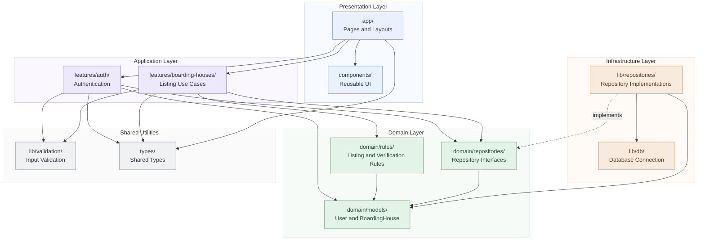

# Package Diagram — Web-Based Boarding House Finder

**Project:** Web-Based Boarding House Finder  
**Team:** Fourward Devs  
**Block:** BSIS 4-1  
**School:** Sorsogon State University (SorSU), Bulan Campus

## Scope

This package diagram presents the proposed folder structure and dependencies of the Web-Based Boarding House Finder. It separates presentation, application logic, domain rules, infrastructure, and shared utilities to support maintainability and clear responsibility boundaries.

## Package Diagram

## Package Descriptions

- **Presentation Layer:** Contains application pages, layouts, and reusable user interface components.
- **Application Layer:** Coordinates authentication and boarding-house listing use cases.
- **Domain Layer:** Defines core domain models, business rules, and repository interfaces.
- **Infrastructure Layer:** Handles repository implementations and database connectivity.
- **Shared Utilities:** Provides reusable input-validation utilities and shared types.

## Dependency Key

- **Solid arrow (`-->`):** Indicates a dependency or usage relationship between packages.
- **Dashed arrow (`-.->`):** Indicates that a repository implementation fulfills a domain repository interface.

## Layering Rule

Dependencies should point toward application and domain abstractions where appropriate. Domain rules and repository interfaces must remain independent of presentation and database implementation details.

## Design Note

This is a proposed package structure for the project. Confirm the folders, framework conventions, and dependency relationships with the team and actual implementation before treating them as the final codebase structure.

## Intended Audience

Developers, system analysts, project advisers, and team members responsible for designing and maintaining the system architecture.

## Risk Reduced

Reduces the risk of unclear module responsibilities, tightly coupled components, and inconsistent handling of business rules and database operations.

## View Note

This diagram presents a proposed logical package structure and dependency relationships. The folder names and architecture may be revised based on the team's selected framework, approved requirements, and actual implementation.
