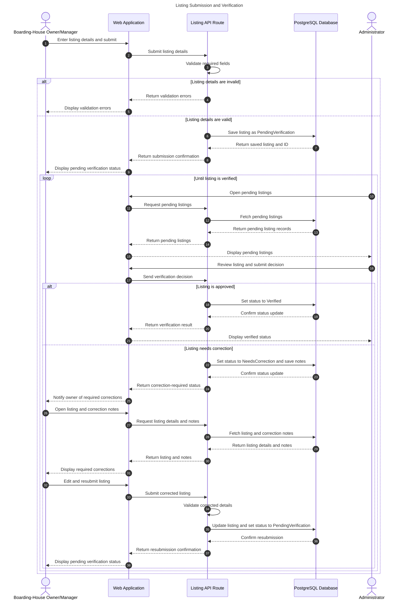

# Sequence Diagram – Listing Submission and Verification

This sequence diagram illustrates the submission and verification of boarding-house listings in the Web-Based Boarding House Finder. It shows how the Owner/Manager submits listing details, how the Web Application and Listing API Route validate and store the information in PostgreSQL, and how the Administrator reviews the listing. Alternative flows cover invalid details, approval, and correction with resubmission.

**Diagram Type:** UML Sequence Diagram

**Scope:** This diagram shows the interactions involved in submitting a boarding-house listing, validating its details, storing it, reviewing it, and handling approval or correction with resubmission.

**Intended Audience:** Project developers, system designers, boarding-house owners or managers, administrators, and project evaluators.

**Risk Reduced:** This view helps reduce misunderstandings about the order of system interactions, validation responses, database updates, and the handling of listings that require correction.

**Key:**
- Solid arrows (`->>`) represent requests or messages.
- Dashed arrows (`-->>`) represent replies or returned results.
- `alt` represents alternative outcomes, including invalid versus valid details and approval versus correction.
- `loop` represents the repeated review process until the listing is verified.

**Architecture Note:** The Listing API Route is modeled as an internal application component, while PostgreSQL is the database. Confirm that these match the architecture agreed upon by the team.

**View Note:** This diagram describes the intended interaction flow. It does not independently confirm that the implementation behaves exactly as shown.
