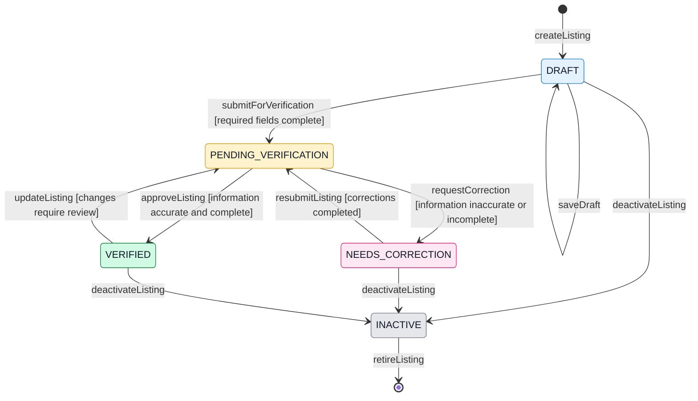

# State Machine Diagram — Boarding-House Listing Lifecycle

**Project:** Web-Based Boarding House Finder  
**Team:** Fourward Devs  
**Block:** BSIS 4-1  
**School:** Sorsogon State University (SorSU), Bulan Campus

## 1. Scope

This state machine describes the proposed lifecycle of a boarding-house listing, from creation and submission to administrator verification, correction, approval, and deactivation. It models the `listingStatus` attribute of the `BoardingHouse` class.

## 2. State Machine Diagram

## 3. State Definitions

- **DRAFT:** The owner or manager is preparing a boarding-house listing.
- **PENDING_VERIFICATION:** The listing has been submitted and awaits administrator review.
- **VERIFIED:** The administrator has approved the listing information.
- **NEEDS_CORRECTION:** The administrator has identified inaccurate or incomplete information.
- **INACTIVE:** The listing is no longer active and is not intended to appear as an active listing.

## 4. Transition Rules

- A listing may be submitted for verification when all required fields are complete.
- The administrator approves a listing when its information is accurate and complete.
- If information is inaccurate or incomplete, the administrator requests corrections.
- The owner or manager resubmits the listing after completing the required corrections.
- Changes to a verified listing return it to pending verification only when those changes require review.
- A listing may be deactivated from the `DRAFT`, `NEEDS_CORRECTION`, or `VERIFIED` state.
- The modeled lifecycle ends when an inactive listing is retired from the process represented in this diagram.

## 5. Intended Audience

Developers, system analysts, project advisers, and team members responsible for listing verification and management.

## 6. Risk Reduced

This diagram reduces ambiguity in listing-status transitions and helps prevent inconsistent handling of listing approval, correction, and deactivation.

## 7. Design Notes

- The diagram models the `listingStatus` field defined in the `BoardingHouse` class.
- `AvailabilityStatus` is a separate attribute and is not part of this state machine.
- Only users with the `ADMINISTRATOR` role may approve listings or request corrections.
- This is a proposed conceptual design. The team must confirm the transition rules with the approved requirements before implementation.
- `retireListing` represents the end of the modeled lifecycle; it does not necessarily mean permanent database deletion.

## 8. View Note

This diagram presents the proposed lifecycle of a boarding-house listing. The team will validate the transitions and business rules against the approved requirements before implementation.
