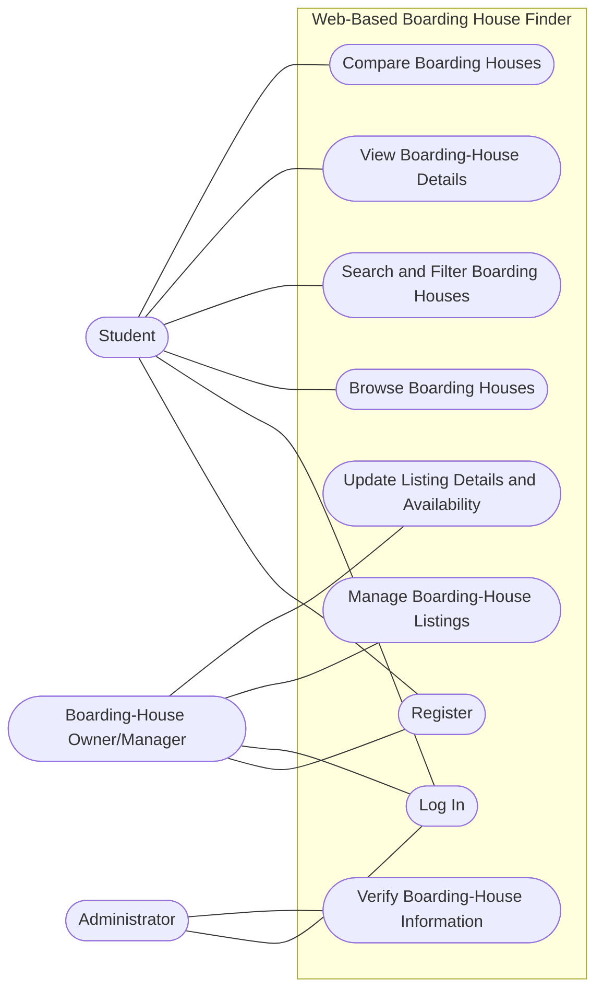

# UML Use Case Diagram

**Diagram Type:** UML Use Case Diagram

**Scope:** This diagram identifies the primary interactions available to students, boarding-house owners or managers, and administrators within the Web-Based Boarding House Finder.

**Intended Audience:** Students, owners or managers, administrators, developers, and project evaluators.

**Risk Reduced:** This view helps reduce ambiguity about user responsibilities and the system functions expected for each role. It can also help the team identify missing or incorrectly assigned use cases.

**View Note:** The diagram focuses on the proposed system's main use cases. It does not show the sequence of steps within each use case or the internal implementation. No `include` or `extend` relationships are shown because no such dependencies have been established here.
